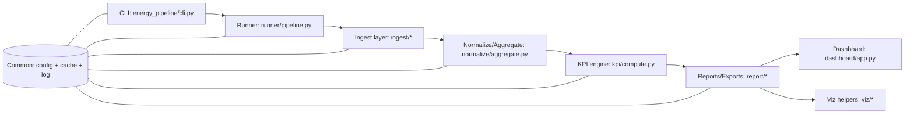
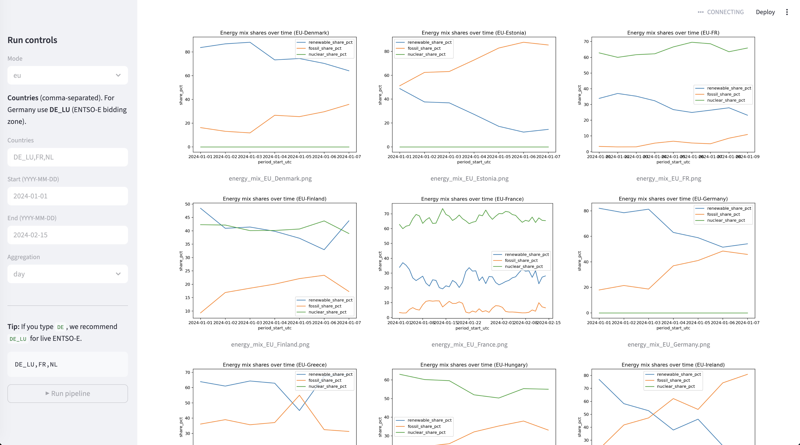

# Energy Market Pipeline

A config-driven Python data pipeline for energy-market KPI processing and lightweight dashboard generation.

## What this project does

- Loads raw datasets (sources defined in `configs/`)
- Applies mapping / normalization rules
- Computes KPIs from configuration
- Writes curated outputs and reports
- Provides modular execution blocks

This repository is designed as a portfolio-grade, reproducible data engineering project with clear separation between configuration and code.

---

## Project structure

.
├── configs/          # YAML configs (sources, mappings, KPIs)
├── data/             # Local outputs
├── src/              # Pipeline logic
├── tests/            # Unit tests
├── run_block*.sh     # Block runners
├── pyproject.toml
├── .env.example
└── .gitignore

---

## Setup

Create virtual environment:

python -m venv .venv
source .venv/bin/activate
python -m pip install --upgrade pip

Install project:

pip install -e .

Configure environment:

cp .env.example .env
# Fill in required values inside .env
# Do NOT commit .env

---

## Run

bash run_block1.sh
bash run_block2.sh
bash run_block3.sh

or

python -m <your_package>

---

## Testing

pytest -q

---

## Security & Reproducibility

- .env and .venv/ are ignored
- .env.example is tracked
- Config-driven design improves portability
- Pipeline logic separated from configuration

---

## Enterprise Upgrade Roadmap

- pre-commit (ruff, formatting)
- CI (GitHub Actions)
- Docker containerization
- Structured logging
- Orchestration (Prefect/Dagster)
- Data quality monitoring

## Architecture

## Dashboard Preview

