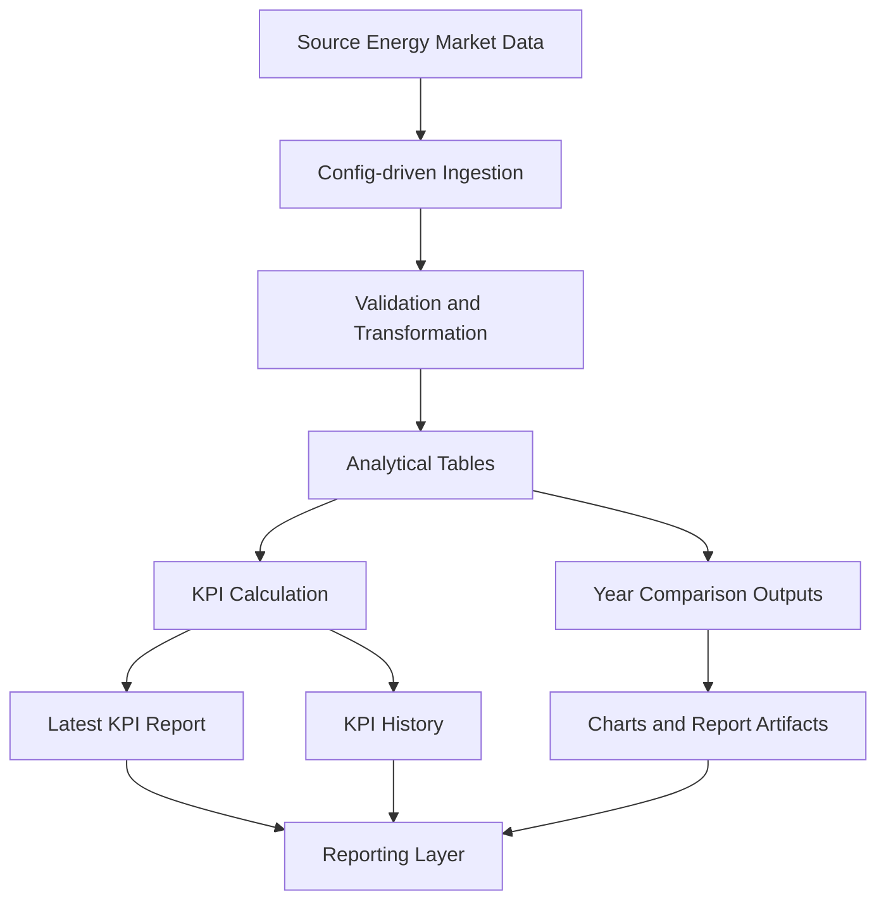

# Energy Market Data Pipeline


Production-style Data Engineering portfolio project for descriptive energy market analytics, KPI generation, and audit-friendly reporting.

The project demonstrates a configuration-driven pipeline that transforms energy market source data into analytical outputs, historical KPI summaries, and reporting-ready artifacts suitable for dashboarding and further analytics use.

---

## Business case

Energy market teams need reliable descriptive analytics around price behavior, year-over-year comparisons, KPI tracking, and quality-controlled reporting.

This project simulates a practical analytics pipeline that supports:

- market KPI reporting
- historical comparison across years
- audit-friendly descriptive outputs
- chart and report generation
- repeatable command-line execution
- portfolio demonstration of time-series analytics engineering

---

## What this project demonstrates

- modular Python package structure under `src/`
- CLI entrypoint for repeatable pipeline runs
- configuration-driven processing
- descriptive KPI generation
- year-over-year comparison outputs
- report-ready artifact generation
- local analytical workflow suitable for portfolio and delivery packaging
- testing, linting, and CI baseline

---

## Architecture



---

## Repository structure

```text
.
├── configs/                # source, mapping and KPI configs
├── data/
│   └── reports/            # runtime KPI/report outputs
├── scripts/                # helper scripts
├── src/energy_pipeline/    # main package
├── pyproject.toml
└── README.md
```

---

## Tech stack

- Python
- Pandas
- PyArrow
- Typer
- Rich
- Matplotlib
- PyYAML
- Pydantic
- Pytest
- Ruff
- GitHub Actions

---

## Pipeline flow

1. Load configuration and source definitions
2. Transform market data into analytical structures
3. Generate descriptive KPI summaries
4. Persist latest KPI report
5. Update KPI history
6. Generate year comparison outputs
7. Create report-oriented artifacts

---

## Outputs

The pipeline produces artifacts such as:

- latest KPI report
- KPI history table
- year comparison dataset
- report-ready charts
- descriptive analytical summaries

### Example KPI output

```json
{
  "report_date": "2026-03-10",
  "avg_price": 84.2,
  "max_price": 132.8,
  "min_price": 51.4,
  "volatility_index": 0.27,
  "missing_rate": 0.01,
  "status": "OK"
}
```

### Example year comparison output

```text
year,current_avg_price,previous_avg_price,change_pct
2024,78.4,71.2,10.11
2025,84.2,78.4,7.40
```

---

## Quickstart

Create and activate a virtual environment:

```bash
python3 -m venv .venv
source .venv/bin/activate
python3 -m pip install --upgrade pip
pip install -e '.[dev]'
```

Run tests:

```bash
pytest
```

Lint the project:

```bash
ruff check .
```

Run the CLI help:

```bash
energy --help
```

---

## Why this is portfolio-relevant

This repository is positioned as a junior-to-medior Data Engineering portfolio project.

It highlights skills that hiring managers and freelance clients can verify quickly:

- config-driven pipeline design
- analytical reporting workflow
- reproducible CLI execution
- structured project layout
- time-series oriented KPI thinking
- maintainability and delivery readiness

---

## Current limitations

- descriptive analytics focus only
- local execution only
- lightweight CI baseline
- no orchestration framework yet

These are deliberate choices to keep the project focused, portable, and easy to review.

---

## Possible next improvements

- anomaly and spike alerting
- stronger schema validation
- dashboard layer
- Docker packaging
- scheduled execution

---

## License

MIT License
